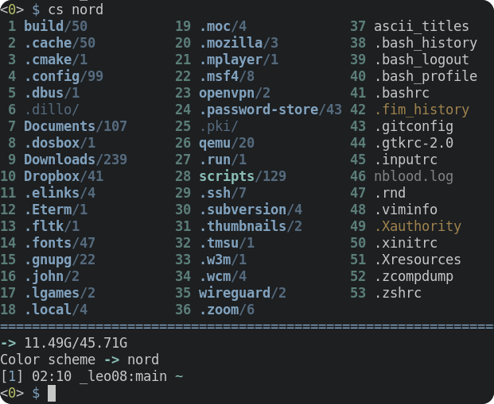

# clifm-colors
> Some color schemes for [CliFM file manager](https://github.com/leo-arch/clifm)

---

## Table of contents
[Screenshots](#screenshots) \
[Installation](#installation) \
[License](#license) \
[Constributing](#contributing) \
[Community](#community)

---

## Screenshots
### Nord

### Amber-256

### Aqua

### Base16

### CGA

### Cold

### Dracula

### Green-256

### Gruvbox

### Molokai

### Solarized-dark

### Sunset

### White-256

### Zenburn

---

## Installation

For Archlinux users: 

1) Install the package (it is available on the [AUR](https://aur.archlinux.org/packages/clifm-colors-git))
2) Color schemes are installed in `$XDG_DATA_DIRS/clifm/colors`. You can create modified versions of these color schemes by copying them to the `colors` directory of your CLiFM local directory (`$XDG_CONFIG_HOME/clifm` or `$HOME/.config/clifm`) and editing them to your liking.
3) Now run CliFM and use the `cs` command to change color schemes.

If not using Arch:

1) Clone this repo:

       git clone https://github.com/leo-arch/clifm-colors

2) cd into the colors directory and copy the color schemes (.cfm files) into the colors directory of your CLiFM local directory (`$XDG_CONFIG_HOME/clifm/colors` or `$HOME/.config/clifm/colors`). If you so prefer, you can copy these files to `$XDG_DATA_DIRS/clifm/colors` (usually, `/usr/share/clifm/colors`) as well.

       cp colors/*.cfm $XDG_CONFIG_HOME/clifm/colors

3) Set the desired color scheme, either via command line (with the `--color-scheme` option) or, once in CLifM, with the `cs` command. You can also permanently set the color scheme using the main configuration file: `clifmrc`.

---

## License
This project is licensed GPL version 2 (or later). \
See the [LICENSE](https://github.com/leo-arch/clifm-colors/blob/master/LICENSE) file for details.

---

## Contributing
Yes. Try these color schemes, modify them, and even create your own themes. If you do so, you can always fork this repo, add your theme, and submit a pull request.

---

## Community
Join CliFM's [Gitter discussion room](https://gitter.im/leo-arch/clifm) and let us know what you think: ideas, comments, observations and questions are always welcome. \
The [Discussions](https://github.com/leo-arch/clifm/discussions) section of CliFM is also open to input.
