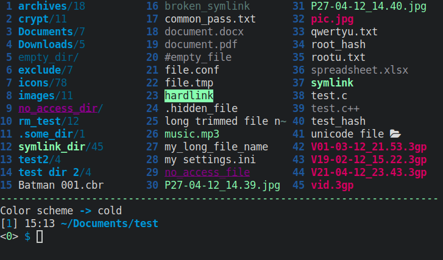
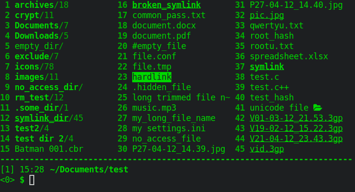

# clifm-colors
> Some color schemes for [CliFM file manager](https://github.com/leo-arch/clifm)

### Packages

## Screenshots

**amber-256**

**aqua**

**base16**

**cga**

**cold**

**dracula**

**forest**

**green-256**

**gruvbox**

**molokai**

**solarized**

**sunset**

**white-256**

**zenburn**

## Installation

For Archlinux users: 
1) Install the package (it is available on the [AUR](https://aur.archlinux.org/packages/clifm-colors-git))
2) Color schemes are installed in `/etc/clifm`. So, copy the `colors` directory to your CLiFM installation directory: `$XDG_CONFIG_HOME/clifm` or `$HOME/.config/clifm`.
3) Now run CliFM and use the `cs` command to change color schemes.

If not using Arch:

1) Clone this repo:

       git clone https://github.com/leo-arch/clifm-colors

2) cd into the colors directory and copy the color schemes (.cfm files) into the colors directory of your CLiFM installation (`$XDG_CONFIG_HOME/clifm/colors` or `$HOME/.config/clifm/colors`)

       cp colors/*.cfm $XDG_CONFIG_HOME/clifm/colors

3) Set the desired color scheme, either via command line (with the `--color-scheme` option) or, once in CLifM, with the `cs` command. You can also permanently set the color scheme using the main configuration file: `clifmrc`.

Try them, modify them, and even create your own themes. If you do so, you can always fork this repo, add your theme, and send a pull request.
