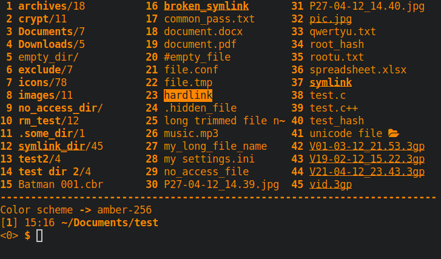

# clifm-colors
> Some color schemes for the [CliFM file manager](https://github.com/leo-arch/clifm)

---

## Table of contents
[Themes list](#themes-list) \
[Screenshots](#screenshots) \
[Installation](#installation) \
[License](#license) \
[Constributing](#contributing) \
[Community](#community) \
[Creating themes](https://github.com/leo-arch/clifm/wiki/Customization#theming)

---

## Themes list
- [x] amber-256 (based on old amber monochrome monitors)
- [x] aqua
- [x] base16
- [x] c64 (based on the Commodore64 color palette)
- [x] cga (based on the CGA color palette)
- [x] cold
- [x] default
- [x] dracula-vivid
- [x] dracula
- [x] gameboy (based on the GameBoy color palette)
- [x] green-256 (based on the old green monochome monitors)
- [x] gruvbox
- [x] jellybeans-vivid
- [x] light
- [x] molokai
- [x] nocolor
- [x] nord
- [x] onedark
- [x] snow
- [x] solarized
- [x] sunset
- [x] white-256
- [x] white
- [x] zenburn

## Screenshots
### Nord

### Amber-256

### Aqua

### Base16

### CGA

### Cold

### Green-256

### Gruvbox

### Molokai

### Solarized-dark

### Zenburn

---

## Installation

#### 1.a For Archlinux users: 

Install the package (it is available on the [AUR](https://aur.archlinux.org/packages/clifm-colors-git)). Color schemes are installed in `$XDG_DATA_DIRS/clifm/colors` (usually `/usr/share/clifm/colors`).

#### 1.b If not using Arch:

a) Clone this repo:

       git clone https://github.com/leo-arch/clifm-colors

b) cd into the colors directory and copy the color schemes (`.cfm` files) into the colors directory of your _CliFM_ local directory (`$XDG_CONFIG_HOME/clifm/colors` or `$HOME/.config/clifm/colors`).

#### 2. Set your theme
Once the theme is copied, set the desired color scheme, either via command line (with the `--color-scheme` option) or, once in _CliFM_, with the `cs` command. You can also permanently set the color scheme using the main configuration file: `clifmrc` (which can be accessed via the `edit` command or pressing <kbd>F10</kbd>).

**Note**: You can create modified/custom versions of these color schemes by copying them into the appropriate directory and editing them to your liking via a simple text editor. For more detailed information consult our [wiki](https://github.com/leo-arch/clifm/wiki/Customization#colors).

---

## License
This project is licensed GPL version 2 (or later). \
See the [LICENSE](https://github.com/leo-arch/clifm-colors/blob/master/LICENSE) file for details.

---

## Contributing
Yes. Try these color schemes, modify them, and even create your own themes. If you do so, you can always fork this repo, add your theme, and submit a pull request.

---

## Community
Join CliFM's [Gitter discussion room](https://gitter.im/leo-arch/clifm) and let us know what you think: ideas, comments, observations and questions are always welcome. \
The [Discussions](https://github.com/leo-arch/clifm/discussions) section of _CliFM_ is also open to input.
