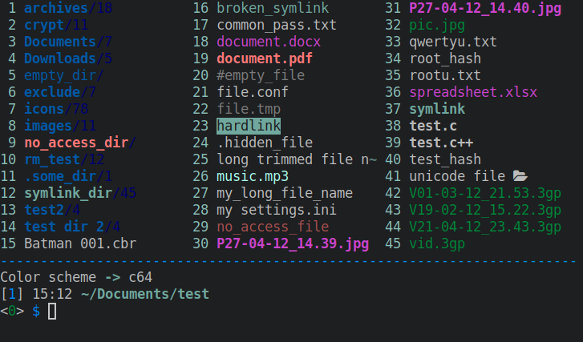
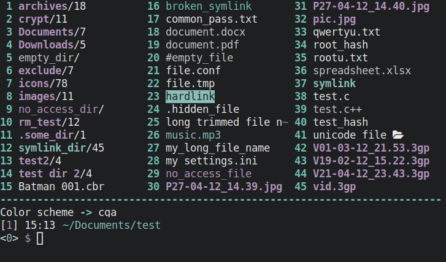
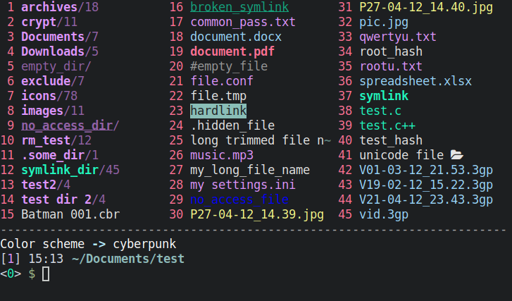
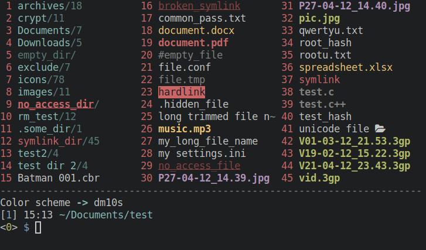
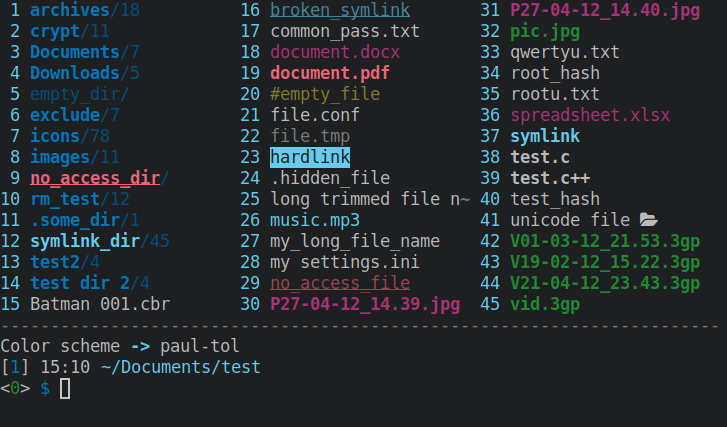
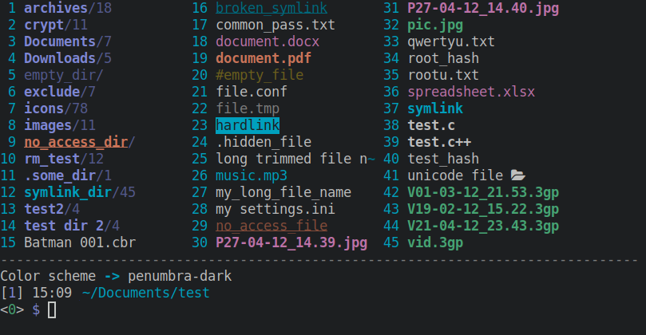
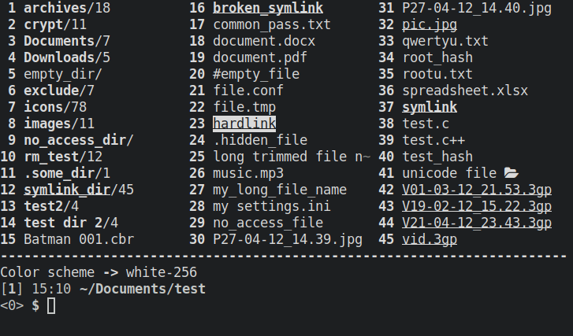
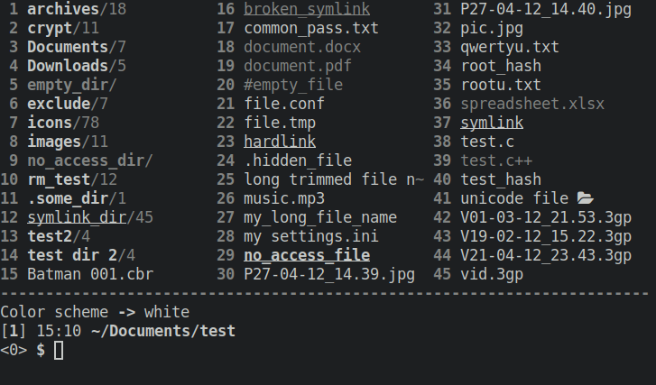

# clifm-colors
> Extra color schemes for the [**clifm** file manager](https://github.com/leo-arch/clifm)

[](https://aur.archlinux.org/packages/clifm-colors-git)
[](https://github.com/leo-arch/clifm/blob/master/LICENSE)

---

## Table of contents
[Themes list](#themes-list) \
[Screenshots](#screenshots) \
[Installation](#installation) \
[License](#license) \
[Constributing](#contributing) \
[Community](#community) \
[Creating themes](https://github.com/leo-arch/clifm/wiki/Customization#theming)

---

## Themes list
- [x] amber-256 (based on old amber monochrome monitors)
- [x] arena-256
- [x] c64 (based on the Commodore64 color palette)
- [x] cga (based on the CGA color palette)
- [x] cold
- [x] cyberpunk
- [x] dm10s
- [x] gameboy (based on the GameBoy color palette)
- [x] green-256 (based on the old green monochome monitors)
- [x] paul-tol (based on [Paul Tol's color-blind safe scheme](https://personal.sron.nl/~pault/))
- [x] penumbra-dark (based on the [penumbra color scheme](https://github.com/nealmckee/penumbra), by nealmckee)
- [x] white
- [x] white-256

## Screenshots

### Amber-256


### Arena-256


### C64


### CGA


### Cold


### Cyberpunk


### Dm10s


### Gameboy


### Green-256


### Paul-tol


### Penumbra-dark


### White-256


### White


---

## Installation

#### 1.a For Archlinux users: 

Install the package (it is available in the [AUR](https://aur.archlinux.org/packages/clifm-colors-git)). Color schemes are installed in `$XDG_DATA_DIRS/clifm/colors` (usually `/usr/share/clifm/colors`).

#### 1.b If not using Arch:

a) Clone this repo:

```sh
git clone https://github.com/leo-arch/clifm-colors
```

b) cd into the `colors` directory and copy the color schemes (`.clifm` files) into the colors directory of your **clifm** local directory (`$XDG_CONFIG_HOME/clifm/colors` or `$HOME/.config/clifm/colors`).

#### 2. Set your theme
Once the theme is copied, set the desired color scheme, either via the command line (with the `--color-scheme` option) or, once in **clifm**, with the `cs` command. You can also permanently set the color scheme using the main configuration file: `clifmrc` (which can be accessed via the `edit` command or pressing <kbd>F10</kbd>).

**Note**: If using a version of **clifm** prior to 1.6.1, the extension of the color theme files must be changed from `.clifm` to `.cfm`. Follow [this link](https://github.com/leo-arch/clifm/wiki/Specifics#new-extension-for-configuration-files) for more details on this issue.

---

## Creating new themes

You can create modified/custom versions of these color schemes by copying them into the appropriate directory and editing them to your liking via a simple text editor. For more detailed information consult the [**clifm** wiki](https://github.com/leo-arch/clifm/wiki/Customization#colors).

---

## License
This project is licensed GPL version 2 (or later). \
See the [LICENSE](https://github.com/leo-arch/clifm-colors/blob/master/LICENSE) file for details.

---

## Contributing
Yes. Try these color schemes, modify them, and even create your own themes. If you do so, you can always fork this repo, add your theme, and submit a pull request.

---

## Community
Join **clifm**'s [Gitter discussion room](https://gitter.im/leo-arch/clifm) and let us know what you think: ideas, comments, observations and questions are always welcome. \
The [Discussions](https://github.com/leo-arch/clifm/discussions) section of **clifm** is also open to input.
